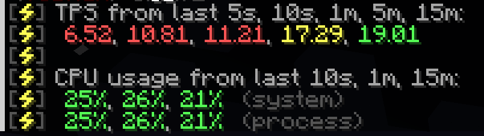
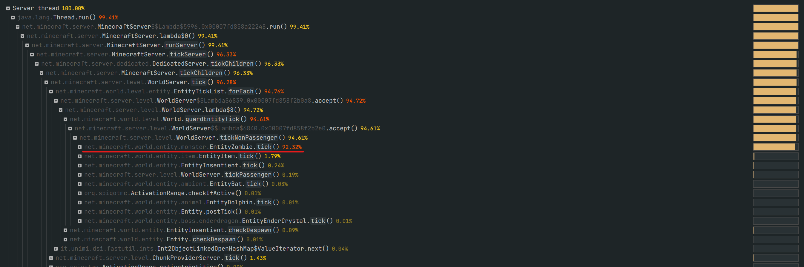

# Serveur, réseau, mémoire & démarrage (Fabric, Forge/NeoForge, Paper)

Trié par **impact** : 🟩 Fort · 🟧 Moyen · 🟥 Faible

---

## Fabric — serveur & réseau

### 🟩 Impact fort

* **Lithium (1.16.2+)** — Optimisations générales (ticking, entités). Gros gains TPS.
* **Starlight (≤ 1.20.4) / ScalableLux (1.21+)** — Lumière ultra-rapide, supprime les spikes.
* **Alternate Current (1.16+)** — Redstone optimisée (jusqu’à ×30 moins de CPU).
* **Very Many Players – VMP (1.18+)** — Serveurs très peuplés : suivi entités/chunks, DR par joueur.
* **Krypton (1.16.2+)** — Pile réseau optimisée → ticks plus stables.
* **C2ME (1.17.1+)** — Chargement/génération de chunks en parallèle.
* **Clumps (1.14.4+)** — Fusion des orbes d’XP → moins d’entités.

### 🟧 Impact moyen

* **Phosphor (1.14.4–1.18.x)** — Ancien moteur de lumière (remplacé par Starlight).
* **Krypton côté client** — léger mieux en solo/coop.

---

## Forge / NeoForge — serveur & réseau

### 🟩 Impact fort

* **Canary / Radium Reforged** — Portages de Lithium → gros gains TPS serveur.
* **FerriteCore** — RAM drastiquement réduite sur gros packs (client & serveur).
* **Starlight (≤ 1.20.2)** — Lumière rapide, corrige les lags d’éclairage.

### 🟧 Impact moyen

* **Pluto** — Réseau (portage de Krypton). Utile en multi.
* **Chunk Sending / Smooth Chunk Save / Connectivity** — Stabilité réseau, sauvegardes et envois de chunks.
* **AI Improvements** — IA mobs moins gourmande CPU.
* **Adaptive Performance Tweaks (APT)** — Tweaks modulaires selon contexte.
* **In Control! / Magnum Torch** — Contrôle des spawns pour limiter la charge d’entités.
* **Chunky (outil)** — Pré-génération (voir section dédiée).

### 🟥 Impact faible / ancien / ciblé

* **Performant (1.14–1.16)** — Utile surtout sur vieilles versions.
* **BetterFPS (≤ 1.12.2)** — Héritage.

---

## Mémoire & temps de chargement (toutes plateformes)

### 🟩 Impact fort

* **FerriteCore (1.16.5+)** — Réduction massive de la RAM (client & serveur).
* **ModernFix (1.16.5+)** — Démarrage 2× plus rapide sur gros packs, moins de RAM (+ correctifs).

### 🟧 Impact moyen

* **Memory Leak Fix (1.14.4–1.20.4)** — Colmate des fuites mémoire connues.
* **LazyDFU (≤ 1.19.4)** — Démarrage plus rapide (intérêt réduit ≥ 1.20).
* **Smooth Boot / ThreadTweak** — Boot plus fluide (moins de micro-freeze).
* **Fastload (Forge)** — Monde/serveur plus rapides à charger.
* **DashLoader (1.16.5–1.20.6, client)** — Cache d’assets pour démarrages suivants.

### 🟥 Impact faible / ancien

* **Saturn** (Forge) — Baisse RAM modérée.
* **FoamFix / TexFix / VanillaFix / DataFixerSlayer (1.12.2 & co.)** — Utilitaires anciens/ciblés.

---

## 🛠️Outils & pratiques indispensables


---

### 🟩 Prégénération avec **Chunky** (prioritaire)

**Pourquoi utiliser Chunky ?**  
La génération des chunks en exploration est l’une des tâches **les plus coûteuses** pour le serveur.  
Résultat : TPS qui chutent, freeze, téléportations.  
➡️ Solution : **prégénérer la carte** pour que tout soit prêt avant l’arrivée des joueurs.

**Téléchargements :**
- Plugin Spigot/Paper (≥1.13) : [Chunky Plugin](https://www.spigotmc.org/resources/chunky.81534/)  
- Mod Forge/NeoForge (≥1.16.5) : [Chunky Forge](https://www.curseforge.com/minecraft/mc-mods/chunky-pregenerator-forge)  
- Mod Fabric (≥1.16) : [Chunky Fabric](https://www.curseforge.com/minecraft/mc-mods/chunky-pregenerator)  
*(Pour Forge 1.7 → 1.18, utilisez plutôt **Chunk Pregenerator**.)*

**Étapes avec worldborder :**
1. Définir le centre :
```mcfunction
/worldborder center <x> <z>
# ex : /worldborder center -100 -250
```

2. Définir la taille :
```mcfunction
/worldborder set 6000
# => diamètre 6000 blocs (rayon 3000)
```
⚠️ Attention : 3000 blocs de rayon = **9 millions de blocs** générés !

3. Sélectionner le monde :
```mcfunction
/chunky world <NomDuMonde>
# ex : /chunky world world
```

4. Caler sur la worldborder :
```mcfunction
/chunky worldborder
```

5. Lancer la prégénération :
```mcfunction
/chunky start
```

**Gestion :**
- Pause : `/chunky pause`
- Reprendre : `/chunky continue`
- Annuler : `/chunky cancel`
- Progression : `/chunky progress`

**Options utiles :**
- `/chunky quiet <interval>` → messages réduits
- `/chunky silent` → aucun message
- `/chunky trim` → supprime chunks hors sélection

---

### 🟩 Profilage & diagnostic avec **Spark**


**Téléchargement :**
- [Dernière version (CI)](https://ci.lucko.me/job/spark)  
- [Mod CurseForge](https://www.curseforge.com/minecraft/mc-mods/spark/files)  
- [Plugin Spigot](https://www.spigotmc.org/resources/spark.57242/)  

---

#### 1) Vérifier l’état global du serveur
```
/spark tps
```
Affiche :  
- **TPS** (Ticks Per Second → santé serveur)  
- **Usage CPU**



20 TPS = serveur en bonne santé.  
Moins = lags proportionnels.

---

#### 2) Identifier les sources de lag

Utiliser le profiler Spark :

- Lags **constants** :
```
/spark profiler --timeout 30
```
- **Pics** de lags :
```
/spark profiler --only-ticks-over 100 --timeout 30
```

➡️ Spark donne un **lien web** avec un rapport détaillé.

Exemple de flamegraph (CPU utilisé par entités/zombies) :  


Vue **World** : nombre d’entités par monde / chunk :  


---

## ⚙️ Réglages par serveur

> Légende d’impact : 🟩 Grand · 🟧 Moyen · 🟥 Bas / situationnel

### **Bukkit.yml**
- **spawn-limits** — *🟩 Grand*  
  - Par défaut : `monsters:70, animals:10, water-animals:15, water-ambient:20, ambient:15`  
  - Optimisé : `monsters:50, animals:8, water-animals:7, water-ambient:10, ambient:1`  
- **chunk-gc.period-in-ticks: 400** — *🟧 Moyen*  
- **ticks-per-(type)-spawns** — *🟧 Moyen*  
  - Optimisé : `monster:5, water:11, water-ambient:21, ambient:31`  

---

### **Spigot.yml**
- **save-user-cache-on-stop-only: true** — *🟧 Moyen*  
- **mob-spawn-range: 6** — *–*  
- **entity.activation-range** — *🟧 Moyen*  
  - Optimisé : `animals:16, monsters:24, raiders:48, misc:8`  
- **merge-radius: item:4.0, exp:6.0** — *🟧 Moyen*  
- **nerf-spawner-mobs: true** — *🟧 Moyen*  

---

### **Paper (paper-world-defaults.yml / paper-global.yml)**
- **max-auto-save-chunks-per-tick: 6** — *🟩 Grand*  
- **hopper.disable-move-event: true** — *🟩 Grand*  
- **use-fast-eigencraft-redstone: true** — *🟩 Grand*  
- **max-entity-collisions: 2** — *🟧 Moyen*  
- **grass-spread-tick-rate: 4** — *🟧 Moyen*  
- **despawn-ranges: soft 28 / hard 96** — *🟥 Bas*  
- **alt-item-despawn-rate** (configurable) — *🟧 Moyen*  

---

### **server.properties**
- **view-distance: 4–8** — *🟩 Grand*  
- **simulation-distance: 4–8** — *🟩 Grand*  
- **network-compression-threshold: 512** — *🟥 Bas*  

---

# ⚙️ Arguments Java (Fabric 1.21.1)

### Commande complète (exemple, 8–12 Go RAM)

```bash
java -Xms8G -Xmx12G -XX:+UseG1GC -XX:+ParallelRefProcEnabled -XX:MaxGCPauseMillis=200 \
-XX:+UnlockExperimentalVMOptions -XX:+DisableExplicitGC -XX:+AlwaysPreTouch \
-XX:G1NewSizePercent=30 -XX:G1MaxNewSizePercent=40 -XX:G1HeapRegionSize=16M \
-XX:G1ReservePercent=20 -XX:G1HeapWastePercent=5 -XX:G1MixedGCCountTarget=4 \
-XX:InitiatingHeapOccupancyPercent=15 -XX:G1MixedGCLiveThresholdPercent=90 \
-XX:G1RSetUpdatingPauseTimePercent=5 -XX:SurvivorRatio=32 -XX:+PerfDisableSharedMem \
-Dusing.aikars.flags=https://mcflags.emc.gs -Daikars.new.flags=true \
-Dterminal.jline=false -Dterminal.ansi=true -jar fabric-server-launch.jar nogui
```

---

## 🧠 Mémoire (Heap Allocation)

* `-Xms8G` → **Mémoire minimale allouée**. Ici le serveur démarre directement avec 8 Go de RAM.
  ✅ Évite que le GC redimensionne le heap constamment.
* `-Xmx12G` → **Mémoire maximale allouée**. Ici 12 Go, sur une machine 16 Go.
  ⚠️ Ne jamais donner 100% de la RAM au serveur (laisser au moins 3–4 Go à l’OS).

💡 Règle pratique : allouer 50–70% de ta RAM totale à Minecraft, mais jamais tout.

---

## 🔄 Garbage Collector (G1GC)

Le **GC** (Garbage Collector) nettoie la mémoire en supprimant les objets inutilisés. Sans réglage, il peut créer des **freeze longs**.
Ces flags forcent **G1GC** (meilleur choix pour Minecraft) à travailler **par petits cycles courts** au lieu de gros nettoyages.

* `-XX:+UseG1GC` → Active le **Garbage Collector G1** (optimisé pour grandes heaps).
* `-XX:+ParallelRefProcEnabled` → Le nettoyage des références (Weak/Soft/Phantom) est **multithread**, donc plus rapide.
* `-XX:MaxGCPauseMillis=200` → Cible des pauses GC ≤ **200 ms** (au lieu de parfois plusieurs secondes).
* `-XX:+DisableExplicitGC` → Ignore les appels manuels à `System.gc()` faits par certains plugins (qui causent souvent de gros freeze).
* `-XX:+AlwaysPreTouch` → Pré-alloue toute la mémoire du heap au lancement → démarrage un peu plus long, mais évite les **micro-lags plus tard**.

---

## ⚙️ Réglages spécifiques G1GC

Ces options contrôlent **comment la mémoire est découpée et utilisée**.

* `-XX:G1NewSizePercent=30` → La “Young Generation” (mémoire des objets récents) occupe **min 30%** du heap → réduit le GC trop fréquent.
* `-XX:G1MaxNewSizePercent=40` → Mais max 40%, pour garder assez de place à la “Old Generation”.
* `-XX:G1HeapRegionSize=16M` → Découpe le heap en **régions de 16 Mo**. Plus gros = moins de fragments mémoire.
* `-XX:G1ReservePercent=20` → Réserve **20% de RAM** pour éviter la fragmentation.
* `-XX:G1HeapWastePercent=5` → Déclenche un GC si plus de 5% de mémoire est “gâchée”.
* `-XX:G1MixedGCCountTarget=4` → Lors d’un cycle, mélange **4 nettoyages old + young** → plus fluide.
* `-XX:InitiatingHeapOccupancyPercent=15` → Lance le GC concurrent dès que le heap est à **15% plein** → évite d’attendre le dernier moment.
* `-XX:G1MixedGCLiveThresholdPercent=90` → Ne nettoie les vieux objets que si <90% sont encore vivants → évite du travail inutile.
* `-XX:G1RSetUpdatingPauseTimePercent=5` → Limite le temps passé à mettre à jour les “remembered sets” (listes de références).
* `-XX:SurvivorRatio=32` → Ratio des Survivor spaces → objets récents migrent plus vite vers Old Gen → évite de saturer Young Gen.

---

## 🛠 Divers

* `-XX:+PerfDisableSharedMem` → Évite des soucis de monitoring qui **ralentissent le GC**.
* `-Dterminal.jline=false` → Console plus simple, évite bugs sur certaines consoles Linux.
* `-Dterminal.ansi=true` → Active les couleurs dans la console (qualité de vie).
* `-Dusing.aikars.flags` & `-Daikars.new.flags` → Juste des **tags de compatibilité** (aucun effet direct, utilisés par Aikar pour identifier les flags).

---

👉 Avec ces réglages, tu as un **serveur stable, sans freeze majeurs liés au GC**, et une gestion mémoire optimisée pour **Minecraft 1.21.1 Fabric**.
